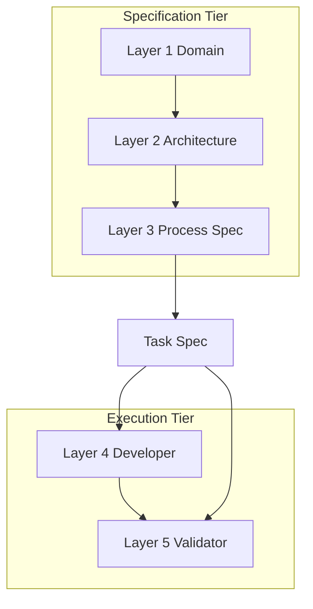
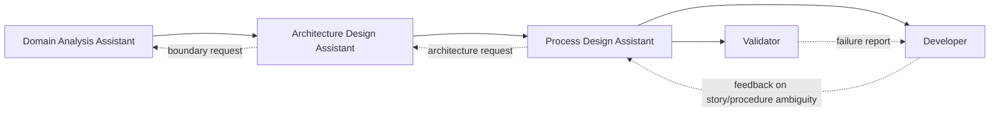

# DomainSpec

_DomainSpec is a layered specification framework for agent-collaborative software development._

It combines domain modeling discipline with standardized delivery workflows so teams can define clear rules first, then execute and validate consistently with agents.

## Inspiration

### From DDD: Domain Decomposition

DomainSpec borrows strategic Domain-Driven Design thinking - bounded contexts, domain events, ubiquitous language, and context mapping - as the foundation of each project. Before code starts, business concepts and boundaries are clarified as shared domain artifacts.

### From Manufacturing: Process Standardization

In manufacturing, each station follows a defined process with clear inputs, outputs, and quality checks. DomainSpec applies the same discipline to software delivery by defining repeatable Process Specs and task flows for agent execution.

## Why Use DomainSpec

- Turn implicit engineering decisions into explicit, auditable specs.
- Reduce implementation drift by enforcing layer responsibilities.
- Use downstream execution and validation as systematic feedback, not ad-hoc rework.

## How It Works (At A Glance)

DomainSpec organizes delivery into two tiers.

- Specification Tier (human-led, agent-assisted)
  - Layer 1: Domain (Domain Expert + Domain Analysis Assistant)
  - Layer 2: Architecture (Architect + Architecture Design Assistant)
  - Layer 3: Process Spec (Dev Lead + Process Design Assistant)
- Execution Tier (agent-led, human-reviewed)
  - Layer 4: Developer
  - Layer 5: Validator

Task Specs (with Given / When / Then acceptance criteria) flow from the Specification Tier to the Execution Tier.

### Agent Interaction Relationship

- Normal flow is top-down: Domain -> Architecture -> Process Spec -> Developer/Validator.
- Feedback flow is bottom-up via explicit Change Requests.
- No layer silently rewrites upstream intent.

See [Workflow](docs/workflow.md) for detailed iteration steps and inter-layer feedback protocol.

## Agents

### Specification Tier

- [Domain Analysis Assistant](docs/agent-domain-analysis-assistant.md): structures and evolves domain artifacts.
- [Architecture Design Assistant](docs/agent-architecture-design-assistant.md): defines system structure, constraints, and ADRs.
- [Process Design Assistant](docs/agent-process-design-assistant.md): converts domain + architecture intent into executable process/task specs.

### Execution Tier

- [Developer](docs/agent-developer.md): implements per Task Spec and owns unit tests.
- [Validator](docs/agent-validator.md): validates acceptance criteria through black-box tests.

## Core Concepts

### Core Principles

1. Spec before code.
2. Layered authority.
3. Downstream as validator.
4. Iterative by design.
5. Separation of test concerns.

### Domain Concepts (Layer 1)

- Domain Glossary
- Four-Color Model
- Domain Event
- Bounded Context
- Context Map

### Architecture Concepts (Layer 2)

- C4 Model
- Inter-Process Architecture
- Intra-Process Architecture
- Architecture Constraints
- ADR (Architecture Decision Record)

### Process Spec Concepts (Layer 3)

- Process Spec
- Process Catalog
- Coding Standards
- Layering Rules
- Test Strategy
- Task Spec
- Acceptance Criteria (Given / When / Then)

### Governance Concepts (Cross-layer)

- Inter-Layer Feedback Protocol
- Change Request
- Iteration Entry Checklist
- Spec Infrastructure

## Documentation

- [Agents Overview](docs/agents-overview.md)
- [Workflow](docs/workflow.md)

## License

[MIT](LICENSE)
