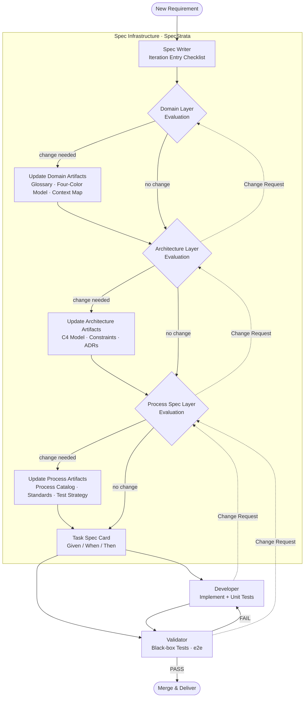

# SpecStrata

> _A layered specification framework for agent-collaborative software development._

SpecStrata is a development methodology that brings together two powerful ideas:

- **Domain-Driven Design (DDD)** — for decomposing complex business domains into well-bounded, meaningful models
- **Manufacturing Process Standardization** — for defining repeatable, structured development workflows the way a factory defines its production lines

The result is a layered system where human experts define the rules at each layer, and AI agents execute, validate, and feed back within those rules.

---

## Inspiration

### From DDD: Domain Decomposition

SpecStrata borrows the strategic design thinking of DDD — bounded contexts, domain events, ubiquitous language, and context mapping — as the foundation of every project. Before any code is written, the business domain must be understood, modeled, and agreed upon. This domain model becomes the source of truth that all downstream layers depend on.

### From Manufacturing: Process Standardization

In manufacturing, a production line does not improvise. Each station has a defined process spec: inputs, steps, outputs, and quality checks. SpecStrata applies this same discipline to software development. Development workflows — how a feature is coded, structured, tested — are pre-defined as **Process Specs** by experienced engineers, and executed consistently by developer agents. Variation is intentional and traceable, not accidental.

---

## Core Principles

1. **Spec before code** — No implementation begins without a complete Task Spec derived from domain and architecture decisions.
2. **Layered authority** — Each layer has a designated human lead. Agents assist, not decide.
3. **Downstream as validator** — Each layer implicitly validates the layer above it by consuming its output. Conflicts surface as structured Change Requests, not silent assumptions.
4. **Iterative by design** — Every new requirement flows through all layers top-down. Each layer evaluates whether a change is needed before passing down.
5. **Separation of test concerns** — Black-box validation (e2e / integration) is owned by the Validator. White-box unit testing is owned by the Developer.

---

## Architecture Overview

SpecStrata is organized into two tiers:

```
┌─────────────────────────────────────────┐
│           SPECIFICATION TIER            │
│  (Human-led, Agent-assisted)            │
│                                         │
│  Layer 1 · Domain      (Domain Expert)  │
│  Layer 2 · Architecture (Architect)     │
│  Layer 3 · Process Spec (Dev Lead)      │
└─────────────────────────────────────────┘
                    │
                    ▼ Task Spec
┌─────────────────────────────────────────┐
│            EXECUTION TIER               │
│  (Agent-led, Human-reviewed)            │
│                                         │
│  Layer 4 · Developer                    │
│  Layer 5 · Validator                    │
└─────────────────────────────────────────┘
```

---

## Core Concepts

### Domain Concepts _(Layer 1)_

| Concept              | Definition                                                                                                                |
| -------------------- | ------------------------------------------------------------------------------------------------------------------------- |
| **Domain Glossary**  | A shared vocabulary of all key business terms — entities, roles, events — used consistently across all layers             |
| **Four-Color Model** | A domain modeling technique identifying Role, Moment/Interval, Description, and Party/Place/Thing to map business reality |
| **Domain Event**     | A meaningful state change in the business domain; a signal for context boundaries                                         |
| **Bounded Context**  | A boundary within which a domain model is internally consistent and authoritative                                         |
| **Context Map**      | A global view of relationships between bounded contexts (upstream/downstream, ACL, shared kernel, etc.)                   |

### Architecture Concepts _(Layer 2)_

| Concept                                | Definition                                                                                                          |
| -------------------------------------- | ------------------------------------------------------------------------------------------------------------------- |
| **C4 Model**                           | A four-level architecture description: Context → Container → Component → Code                                       |
| **Inter-Process Architecture**         | Communication patterns between services (sync/async, protocols, contract formats), described at the Container level |
| **Intra-Process Architecture**         | Internal layering and module structure within a single service, described at the Component level                    |
| **Architecture Constraints**           | Non-negotiable structural rules: dependency direction, boundary isolation, etc.                                     |
| **ADR (Architecture Decision Record)** | A documented record of a key architectural decision: context, options considered, and conclusion                    |

### Process Spec Concepts _(Layer 3)_

| Concept                 | Definition                                                                                                                                                             |
| ----------------------- | ---------------------------------------------------------------------------------------------------------------------------------------------------------------------- |
| **Process Spec**        | A pre-defined, standardized development pattern describing the execution path, code structure, and call chain for a class of tasks                                     |
| **Process Catalog**     | The full collection of defined Process Specs, organized by scenario (e.g. CRUD, event publishing, query aggregation)                                                   |
| **Coding Standards**    | Naming conventions, formatting rules, and comment requirements that apply across all Process Specs                                                                     |
| **Layering Rules**      | Fine-grained rules for layer responsibilities and forbidden dependencies within a service                                                                              |
| **Test Strategy**       | Defines the scope, granularity, and tooling for each category of testing                                                                                               |
| **Task Spec**           | A complete specification card for a single development task: business context, technical requirements, assigned Process Spec, execution steps, and acceptance criteria |
| **Acceptance Criteria** | Verifiable completion conditions written in Given / When / Then format; the sole input for Validator test construction                                                 |

### Governance Concepts _(Cross-layer)_

| Concept                           | Definition                                                                                                                                                           |
| --------------------------------- | -------------------------------------------------------------------------------------------------------------------------------------------------------------------- |
| **Inter-Layer Feedback Protocol** | The rule that downstream layers must raise structured Change Requests — never silently assume or self-correct — when upstream output is inconsistent or unactionable |
| **Change Request**                | A structured feedback artifact containing: originating layer, target layer, triggering task, conflict description, downstream impact, and suggested direction        |
| **Iteration Entry Checklist**     | A top-down evaluation run by the Spec Writer at the start of every iteration to determine which layers require updates                                               |
| **Spec Infrastructure**           | The complete set of outputs from the Specification Tier; the single source of truth for all Execution Tier behavior                                                  |

---

## Agents

### Specification Tier

#### 🟣 Domain Analysis Assistant

_Serves: Domain Expert_

|                            |                                                                                                                                    |
| -------------------------- | ---------------------------------------------------------------------------------------------------------------------------------- |
| **Responsibility**         | Assist the domain expert in applying the Four-Color Model for strategic domain design; structure and maintain all domain artifacts |
| **Input**                  | Business descriptions, user interviews, raw requirements                                                                           |
| **Output**                 | Domain Glossary, Four-Color Model diagrams, Domain Event map, Context Map                                                          |
| **Iteration trigger**      | New requirement introduces unknown business concepts, roles, or cross-context events                                               |
| **Receives feedback from** | Architecture layer: domain boundaries conflict with architectural boundaries                                                       |

#### 🔵 Architecture Design Assistant

_Serves: Architect_

|                            |                                                                                                            |
| -------------------------- | ---------------------------------------------------------------------------------------------------------- |
| **Responsibility**         | Assist the architect in designing the C4 architecture from the domain model; document constraints and ADRs |
| **Input**                  | Context Map, non-functional requirements, technology stack                                                 |
| **Output**                 | C4 architecture model, Architecture Constraints document, ADRs                                             |
| **Iteration trigger**      | New requirement introduces new service boundaries, communication patterns, or non-functional constraints   |
| **Receives feedback from** | Process layer: architecture constraints cannot be mapped to executable Process Specs                       |
| **Escalates to**           | Domain layer: domain boundary conflicts with architecture boundary                                         |

#### 🟠 Spec Writer

_Serves: Dev Lead_

|                            |                                                                                                                                                                                                                                                  |
| -------------------------- | ------------------------------------------------------------------------------------------------------------------------------------------------------------------------------------------------------------------------------------------------ |
| **Responsibility**         | Consume domain and architecture outputs; define the Process Catalog, Coding Standards, Layering Rules, and Test Strategy aligned to current technology decisions; run the Iteration Entry Checklist; decompose requirements into Task Spec cards |
| **Input**                  | Domain Glossary + C4 Model + ADRs + business requirements                                                                                                                                                                                        |
| **Output**                 | Process Catalog, Coding Standards, Layering Rules, Test Strategy, Task Spec cards                                                                                                                                                                |
| **Iteration trigger**      | New requirement introduces a development pattern not covered by existing Process Specs, or technology decisions change                                                                                                                           |
| **Receives feedback from** | Developer: Process Spec conflicts with actual code structure; Validator: Acceptance Criteria are ambiguous                                                                                                                                       |
| **Escalates to**           | Architecture layer: architecture constraints cannot be expressed as actionable Process Specs                                                                                                                                                     |

### Execution Tier

#### 🟢 Developer

_Agent-led, human-reviewed_

|                            |                                                                                                              |
| -------------------------- | ------------------------------------------------------------------------------------------------------------ |
| **Responsibility**         | Implement code strictly according to the Task Spec and assigned Process Spec; own all white-box unit testing |
| **Input**                  | Task Spec card, Process Spec template, codebase context                                                      |
| **Output**                 | Production code conforming to Process Spec, unit tests                                                       |
| **Receives feedback from** | Validator: failure report with localization                                                                  |
| **Escalates to**           | Spec Writer: Process Spec is conflicting, ambiguous, or missing coverage                                     |

#### 🔴 Validator

_Agent-led, human-reviewed_

|                    |                                                                                                                                                       |
| ------------------ | ----------------------------------------------------------------------------------------------------------------------------------------------------- |
| **Responsibility** | Execute black-box tests (e2e / integration) derived from Task Spec Acceptance Criteria; verify that business and technical requirements are satisfied |
| **Input**          | Acceptance Criteria (Given / When / Then), deployed system                                                                                            |
| **Output**         | Test report: pass / fail with failure localization                                                                                                    |
| **Does not own**   | Code quality, unit test coverage (owned by Developer)                                                                                                 |
| **Escalates to**   | Spec Writer: Acceptance Criteria are unclear or untestable                                                                                            |

---

## Inter-Layer Feedback Protocol

> Downstream layers are the implicit validators of upstream output.
> When a conflict or gap is found, a **Change Request must be raised** — never silently assumed away.

### Change Request Format

```
Change Request
├── From:        Originating layer (e.g. Process Layer)
├── To:          Target layer (e.g. Architecture Layer)
├── Trigger:     The specific task or requirement that surfaced the issue
├── Conflict:    Description of the specific conflict or gap found
├── Impact:      Effect on the originating layer if left unresolved
└── Suggestion:  Recommended direction for resolution (advisory, not prescriptive)
```

### Feedback Chain

| From               | To                 | Typical Trigger                                                                |
| ------------------ | ------------------ | ------------------------------------------------------------------------------ |
| Architecture Layer | Domain Layer       | Domain boundary split causes architectural boundary conflict                   |
| Process Layer      | Architecture Layer | Architecture constraint cannot be expressed as an executable Process Spec      |
| Developer          | Process Layer      | Process Spec template conflicts with actual technology stack or code structure |
| Validator          | Process Layer      | Acceptance Criteria are ambiguous or cannot be used to construct test cases    |

---

## Workflow

### Phase 0 — Initialization _(one-time)_

Establish the Spec Infrastructure before any development begins.

```
Domain Expert  → [Domain Analysis Assistant]      → Domain Glossary + Four-Color Model + Context Map + Event Map
Architect      → [Architecture Design Assistant]  → C4 Model + Architecture Constraints + ADRs
Dev Lead       → [Spec Writer]                    → Process Catalog + Coding Standards + Layering Rules + Test Strategy

                                                    ↓
                                            Spec Infrastructure established
```

### Phase N — Iteration _(every new requirement)_

Every requirement enters at the top and flows down. Each layer evaluates whether a change is needed before passing to the next.

```
New Requirement
    │
    ▼
[Spec Writer] runs Iteration Entry Checklist
    │
    ▼
Domain Layer Evaluation
    ├─ New business concept / role / event?
    ├─ Existing context boundary affected?
    ├─ YES → Update Domain Glossary / Four-Color Model / Context Map → propagate change
    └─ NO  → pass through
    │
    ▼
Architecture Layer Evaluation
    ├─ New service / container / communication pattern needed?
    ├─ New non-functional constraint introduced?
    ├─ YES → Update C4 Model / Architecture Constraints / ADRs → propagate change
    └─ NO  → pass through
    │
    ▼
Process Spec Layer Evaluation
    ├─ Development pattern not covered by existing Process Specs?
    ├─ Coding standards or test strategy update needed?
    ├─ YES → Update Process Catalog / standards
    └─ NO  → proceed to Task Spec decomposition
    │
    ▼
Task Spec Output
    └─ Task Spec cards with Acceptance Criteria (Given / When / Then)
         │
         ├─→ Developer  · implement per Process Spec + own unit tests
         │
         └─→ Validator  · execute black-box tests against Acceptance Criteria
                  ├─ PASS → merge and deliver
                  └─ FAIL → Change Request → Developer / Spec Writer
```

---

## Full Flow Diagram



---

## Repository Structure _(suggested)_

```
spec-strata-agents/
├── README.md
├── domain/
│   ├── glossary.md
│   ├── four-color-model.md
│   ├── event-map.md
│   └── context-map.md
├── architecture/
│   ├── c4/
│   ├── constraints.md
│   └── adr/
├── process/
│   ├── catalog/
│   ├── coding-standards.md
│   ├── layering-rules.md
│   └── test-strategy.md
├── specs/
│   └── tasks/
├── agents/
│   ├── domain-analysis-assistant/
│   ├── architecture-design-assistant/
│   ├── spec-writer/
│   ├── developer/
│   └── validator/
└── governance/
    └── change-request-template.md
```

---

## License
