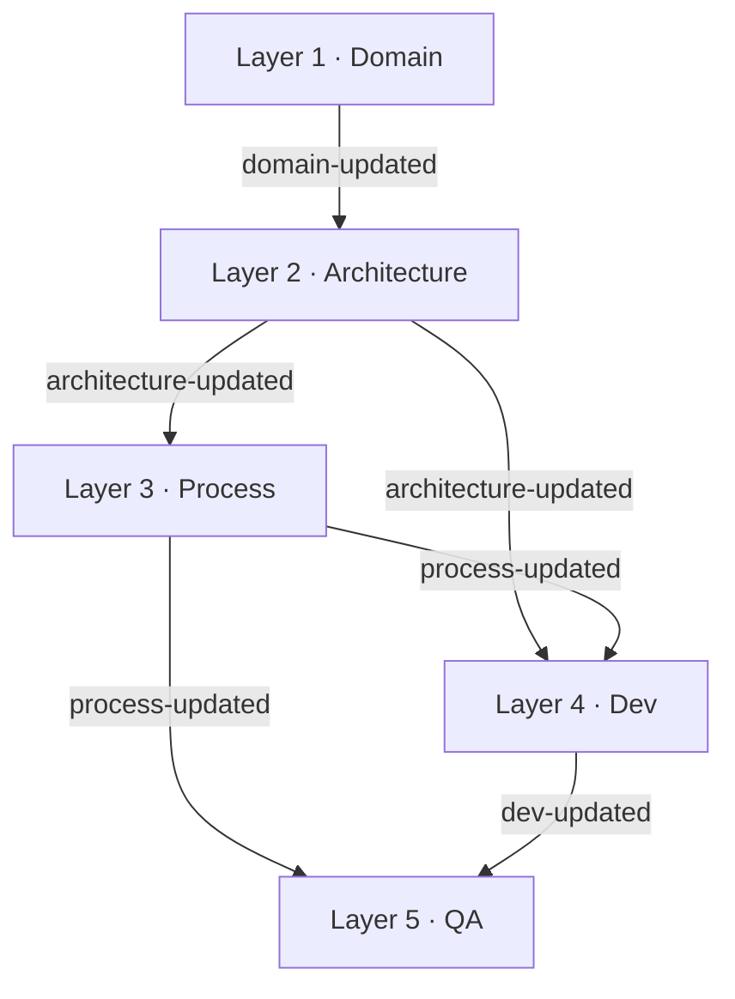
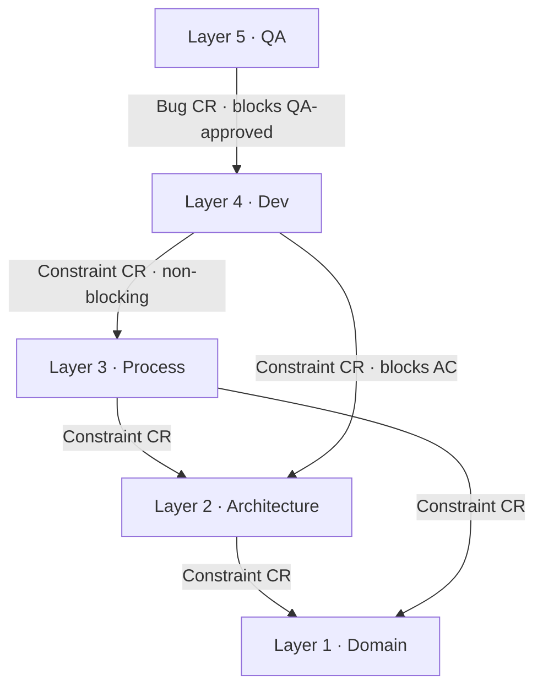
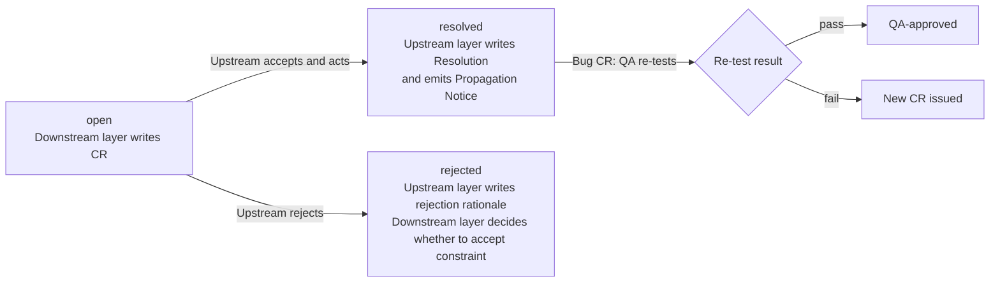
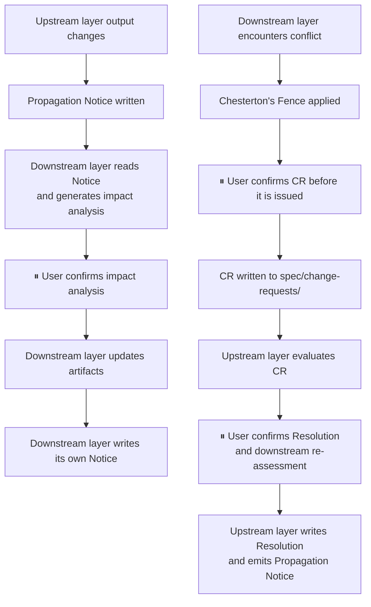

# Cross-Layer Communication Design

## 1. Design Intent

Each Agent in DomainSpec operates independently. Every layer owns a strictly defined write scope and only reads artifacts produced by upstream layers. Layers do not call each other directly and do not share state. The communication mechanism is the only legitimate channel for inter-layer collaboration.
Two directional problems must be solved:

| Direction              |                                                                                                                                | Problem |
| ---------------------- | ------------------------------------------------------------------------------------------------------------------------------ | ------- |
| Downstream propagation | When an upstream layer's output changes, how does it notify downstream layers to respond?                                      |
| Upstream feedback      | When a downstream layer encounters a constraint conflict or quality issue, how does it request changes from an upstream layer? |

These two directions are handled by two independent mechanisms: Propagation Notice and Change Request.

## 2. Propagation Notice — Downstream Propagation

### 2.1 Definition

- A Propagation Notice is a structured notification file written to spec/notices/ by an upstream layer upon completing its output. Its purpose is to declare: "my output has changed — downstream layers need to respond."
- A Notice carries no instructions. It does not prescribe what downstream layers must do. Each downstream layer reads the Notice, independently assesses the impact on its own artifacts, and decides how to respond.

### 2.2 Trigger Conditions

A Notice is produced under the following conditions:

| Layer        | Trigger                                                                         |
| ------------ | ------------------------------------------------------------------------------- |
| Domain       | Glossary or Domain Model entry created, updated, or deprecated                  |
| Architecture | ADR, Component Diagram, or Interface Contract created or changed                |
| Process      | Story created, updated, or closed; Procedure created or changed                 |
| Dev          | Implementation Plan confirmed; code or unit tests written                       |
| QA           | Test Plan confirmed; Test Report generated; Story or Release marked QA-approved |

### 2.3 Propagation Paths



Design constraints:

- Propagation flows downstream only — never upstream
- Each layer subscribes only to Notices relevant to its own inputs
- Architecture Notices fan out to both Process and Dev, since both depend on architectural artifacts

### 2.4 Notice File Structure

```
spec/notices/
└── <layer>-updated-<timestamp>.md
```

Notice file content:

```md
# Notice: <layer>-updated-<timestamp>

**From layer:** <layer>
**Timestamp:** <ISO 8601>
**Trigger:** <UC ID and description>

## Changed Artifacts

- <artifact path>: <change type: created | updated | superseded>

## Downstream Layers

- <layer>: <what they need to respond to>

## Related IDs

- Story: STORY-<id> ← if applicable
- CR: CR-<id> ← if applicable
- Plan: PLAN-<id> ← if applicable
```

### 2.5 Downstream Response Obligations

Upon receiving a Notice, a downstream layer Agent must:

1. Read the Notice and identify the changed artifacts
2. Determine which of its own artifacts are affected
3. Apply Chesterton's Fence: before modifying any existing artifact, identify its dependencies and original intent
4. Present the impact analysis to the user and await confirmation
5. Update affected artifacts
6. Write its own Notice to continue propagation downstream

## 3. Change Request — Upstream Feedback

### 3.1 Definition

A Change Request (CR) is a structured request written by a downstream layer when it encounters a constraint conflict, capability gap, or quality failure that it cannot resolve within its own scope. Its purpose is to declare: "I cannot complete this task under the current constraints — the upstream layer needs to make an adjustment."

A CR is the only legitimate upstream communication path in the framework. Downstream layers must never work around constraints unilaterally. All conflicts must be escalated via CR.

### 3.2 CR Types

Two fundamentally different CR types exist in the framework:

| Type          | Trigger                                                                                            | Example                                                                                                                             |
| ------------- | -------------------------------------------------------------------------------------------------- | ----------------------------------------------------------------------------------------------------------------------------------- |
| Constraint CR | Downstream layer finds that current constraints cannot satisfy task requirements                   | Dev finds a Story AC conflicts with an architectural principle; Process finds a Story requires a domain concept that does not exist |
| Bug CR        | QA finds that the implementation does not satisfy a Story AC or supplementary acceptance condition | A test case fails; integration behavior contradicts an interface contract                                                           |

### 3.3 Propagation Paths



Design constraints:

CRs flow upstream only — never downstream, never sideways
Every CR has exactly one from_layer and one to_layer
CRs cannot skip layers: Dev cannot send a CR directly to Domain; it must go through Architecture or Process

### 3.4 Blocking Rules

Whether a CR blocks the issuing layer's work depends on the nature of the conflict:

| From         | To                    | Blocking Behavior                                                                                                                               |
| ------------ | --------------------- | ----------------------------------------------------------------------------------------------------------------------------------------------- |
| Dev          | Architecture          | Blocks the corresponding AC — code generation for that AC pauses until the CR is resolved                                                       |
| Dev          | Process               | Non-blocking — missing Procedure coverage: Dev continues implementation; out-of-scope risk: Dev does not implement but does not block other ACs |
| QA           | Dev                   | Blocks QA-approved — the Story or Release cannot be marked as passed until the CR is resolved and re-tests pass                                 |
| Architecture | Domain                | User-determined — user decides whether to pause Architecture work                                                                               |
| Process      | Domain / Architecture | User-determined — user decides whether to pause Story decomposition                                                                             |

### 3.5 CR File Structure

```
spec/change-requests/
└── CR-<id>-<from-layer>.md
```

CR file content:

```md
# CR-<id>: <title>

**Type:** constraint | bug
**From layer:** <layer>
**To layer:** <layer>
**Status:** open | resolved | rejected
**Created:** <timestamp>
**Resolved:** <timestamp> ← filled on resolution

## Context

<The Story / AC / artifact ID that triggered this CR>

## Problem Statement

<Precise description of the conflict or failure:

- What the current constraint is
- Why it cannot satisfy the requirement
- Or: observed behavior vs expected behavior (Bug CR)>

## Chesterton's Fence

<Pre-change analysis:

- Which artifacts are affected
- Why they were designed this way
- What other artifacts would be impacted by changing them>

## Requested Change

<What the upstream layer is being asked to do:

- Create / modify / deprecate which artifact
- Expected direction of the change>

## Impact if Not Resolved

<What happens to the issuing layer's work if this CR is not accepted>

## Blocked Artifacts ← Constraint CR only

- <artifact ID>: <reason blocked>

## Failing Test Cases ← Bug CR only

| TC ID  | Observed | Expected   |
| ------ | -------- | ---------- |
| TC-<n> | <actual> | <expected> |

## Severity ← Bug CR only

critical | high | medium | low

## Resolution ← filled on resolution

<How the upstream layer resolved this CR and which artifacts were changed>
```

### 3.6 CR Lifecycle



Key rules:

- When a CR is resolved, the upstream layer must emit a Propagation Notice to trigger downstream response
- When a Bug CR is resolved, QA must re-execute the affected test cases — Dev's declaration of resolution alone is not sufficient to mark the Story as QA-approved
- When a CR is rejected, the downstream layer must present the impact to the user; a human decides the next step

## 4. Mechanism Comparison

| Dimension         | Propagation Notice                                             | Change Request                                                                |
| ----------------- | -------------------------------------------------------------- | ----------------------------------------------------------------------------- |
| Direction         | Downstream (upstream → downstream)                             | Upstream (downstream → upstream)                                              |
| Initiated by      | Layer that completed output                                    | Layer that encountered a conflict or failure                                  |
| Carries           | Change declaration + affected artifact list                    | Problem description + change request + blocking status                        |
| Receiver behavior | Independently assesses impact, updates own artifacts           | Evaluates request, accepts or rejects, writes Resolution                      |
| Blocking          | Never blocking — informational only                            | May block, depending on CR type and layer                                     |
| Human gate        | Downstream layer presents impact analysis, awaits confirmation | Before CR is issued; again after Resolution when downstream layer re-assesses |
| File location     | spec/notices/                                                  | spec/change-requests/                                                         |

## 5. Human Confirmation Gates

The communication design enforces two categories of mandatory human confirmation:



### Gate 1 — Impact confirmation (Notice path):

Before a downstream layer modifies any of its own artifacts in response to a Notice, it must present its impact analysis to the user and receive explicit confirmation. No artifact is updated silently.

### Gate 2 — CR issuance confirmation:

Before a CR is written, the issuing layer presents the conflict, the Chesterton's Fence analysis, and the requested change to the user. The user confirms before the CR is filed.
Gate 3 — Resolution confirmation:
After an upstream layer resolves a CR and emits a Notice, the downstream layer re-assesses its affected artifacts and presents the updated impact analysis to the user before making any changes.

## 6. Invariants

These rules hold unconditionally across all layers and all scenarios:

| #   | Invariant                                                                                             |
| --- | ----------------------------------------------------------------------------------------------------- |
| 1   | Propagation Notices flow downstream only                                                              |
| 2   | Change Requests flow upstream only                                                                    |
| 3   | No layer modifies another layer's artifacts                                                           |
| 4   | No layer bypasses a constraint unilaterally — all conflicts are escalated via CR                      |
| 5   | No artifact is updated silently — every change triggered by a Notice or CR requires user confirmation |
| 6   | A CR resolution always produces a Propagation Notice                                                  |
| 7   | A Bug CR resolution always requires QA re-execution before QA-approved status is granted              |
| 8   | CRs cannot skip layers                                                                                |
