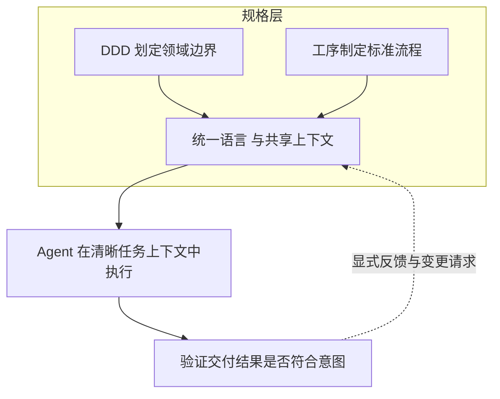

# Agents 驱动领域建模

**DomainSpec 解决的是“上下文与建模意图在交付过程中逐步失真”这个问题。**

团队最初说清楚了需求，到了架构、开发、测试阶段却逐步偏离原意。它不是另一套“写文档的方法”，而是一套让同一份上下文从业务讨论一路延续到执行与验证的框架。

**它的核心很直接：先定边界，再定流程。**

先用 DDD 划定领域边界，明确哪些概念属于哪个上下文；再用工序设计制定标准流程，明确每一步的输入、输出和校验点。边界和流程一旦被写清楚，Agent 才能高效执行，而不是靠猜。

即使没有 Agent，这个问题也一直存在：需求会在架构、开发和测试之间逐步走样，上下文会在一次次交接里慢慢丢失。

Agent 不是根因，只是把速度拉高了。问题会更早暴露，也更容易被放大。没有边界的速度，只会更快地产生偏差。DomainSpec 的价值，就是先把边界、规则和交接关系固定下来。

## “统一语言和上下文”

**这正好击中 DDD 最难落地的地方：统一语言。**

领域专家、架构师、开发者、验证者经常在说同一个词时指向不同对象，或者面对同一个对象用了不同名字。人会因此误解，Agent 只会把这种误解放大。

DomainSpec 把统一语言从“会议共识”变成可传递的工件，再把这些工件持续传到后续层级，让 Agent 的上下文始终和 DDD 的上下文保持一致。

1. **这里的“上下文”不是背景材料，而是决策的边界条件。**

   DDD 里的 bounded context，不只是业务建模单元，也是 Agent 协作单元；领域词汇表不只是给人读的说明，也是提示词、任务规格和验证标准的锚点。

   上下文一旦变化，就必须通过显式工件传递，而不是靠聊天记录里的模糊补充。

2. **分层不是为了形式完整，而是为了防止语义漂移。**

   规格层负责定义含义、结构和流程，执行层负责实现和验证。反馈也不能绕开上游模型，而要通过显式 Change Request 回流。

   这样系统修正的是规格本身，不是让实现偷偷改写原始意图。

---

## Agents

### human-led, agent-assisted

- **Domain Analysis Assistant**
  - **职责：** 定义业务领域模型，并在各类领域工件之间保持术语一致。
  - **产物：** Glossary、Four-Color Model、Event Map、Context Map。
- **Architecture Design Assistant**
  - **职责：** 把领域边界转换成系统级与服务级架构，并明确约束条件。
  - **产物：** System Context、Service Decomposition、Communication Map、NFR Analysis、ADR、服务级组件设计。
- **Process Design Assistant**
  - **职责：** 把架构约束进一步转成可复用工序和可执行的 Story。
  - **产物：** Procedure Catalog、Story Spec、流程一致性校验结果。

### agent-led, human-reviewed

- **Developer**
  - **职责：** 在架构和工序约束下实现已确认的 Story。
  - **产物：** Implementation Plan、业务代码、单元测试、开发校验报告。
- **Validator**
  - **职责：** 以黑盒方式验证交付结果，并把缺口反馈回交付层。
  - **产物：** Test Plan、测试代码、测试报告、缺陷类 Change Request。

**一句话总结：** DDD 负责划边界，工序负责定流程，Agent 只有在上下文持续统一时才能真正高效，而 DomainSpec 的作用就是把这份上下文固定下来、传递下去、在反馈中持续校正。

---

---

> **项目地址：** <https://github.com/Anddd7/domain-spec-agents>
>
> **示例地址：** <https://github.com/Anddd7/domain-spec-examples/pulls>
