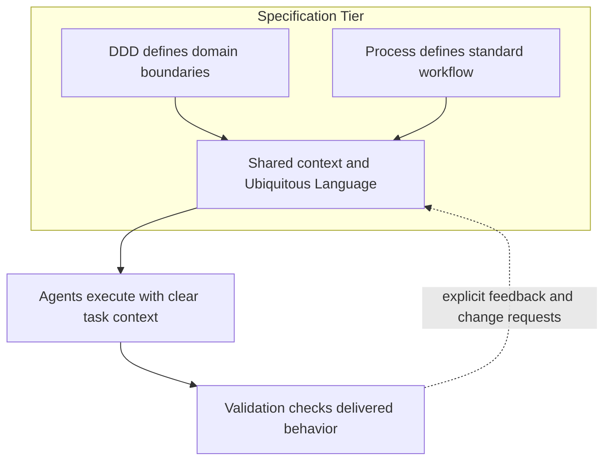

# Agent-Driven Domain Modeling

**DomainSpec solves a specific failure mode: context and modeling intent drift across delivery stages.**

Teams agree on requirements, then lose that agreement as work moves from domain discussion to architecture, then to implementation and testing. It is not another documentation framework. It is a way to keep the same context alive across the whole path from idea to execution.

**The core idea is simple: define boundaries first, then define workflow.**

DDD is used to define domain boundaries. Process design is used to define standard delivery steps. Once both are explicit, agents can execute efficiently instead of improvising.

That is the missing bridge in many AI-assisted teams.

This problem exists even without agents. Requirements drift across architecture, implementation, and testing, and shared context gets lost through repeated handoffs.

Agents are not the root cause. They raise the speed. The same problems surface earlier and get amplified more easily. Speed without boundaries creates drift. DomainSpec gives that speed boundaries, rules, and handoff points.

## "Ubiquitous Language and Context"

**This matters because DDD often fails at the hardest point: maintaining Ubiquitous Language.**

Domain experts, architects, developers, and validators often use the same words for different things, or different words for the same thing. Agents magnify that problem if the context is vague.

DomainSpec turns ubiquitous language into working artifacts, then carries those artifacts forward so the agent context stays aligned with the domain context.

1. **Context is not background information. It is the system of record for decisions.**

   The same bounded context that separates business responsibilities also separates agent responsibilities. The same glossary that reduces ambiguity for people reduces ambiguity for prompts, specs, and validation.

   If the context changes, the change must move through explicit artifacts instead of leaking through informal chat.

2. **The layered structure exists to prevent semantic drift.**

   The specification tier defines meaning, structure, and process. The execution tier implements and validates against that intent. Feedback does not bypass the model. It goes upstream as a change request.

   That way the system corrects the specification itself instead of letting implementation silently rewrite original intent.

---

## Agents At A Glance

### human-led, agent-assisted

- **Domain Analysis Assistant**
  - **Responsibility:** Defines the business model and keeps domain language consistent across artifacts.
  - **Deliverables:** Glossary, four-color model, event map, context map.
- **Architecture Design Assistant**
  - **Responsibility:** Translates domain boundaries into system and service architecture with explicit constraints.
  - **Deliverables:** System context, service decomposition, communication map, NFR analysis, ADRs, service component design.
- **Process Design Assistant**
  - **Responsibility:** Converts architecture into repeatable procedures and implementation-ready Stories.
  - **Deliverables:** Procedure catalog, Story specs, process validation outputs.

### agent-led, human-reviewed

- **Developer**
  - **Responsibility:** Implements confirmed Stories within architectural and process constraints.
  - **Deliverables:** Implementation plan, business code, unit tests, dev validation report.
- **Validator**
  - **Responsibility:** Verifies delivered behavior as a black box and reports gaps back to delivery.
  - **Deliverables:** Test plan, test code, test report, bug change requests.

**In one sentence:** DDD defines the boundaries, process defines the workflow, and agents execute well only when both share the same living context. DomainSpec exists to make that context explicit, stable, and reusable.

---

---

> **Project:** <https://github.com/Anddd7/domain-spec-agents>

> **Examples:** <https://github.com/Anddd7/domain-spec-examples/pulls>
